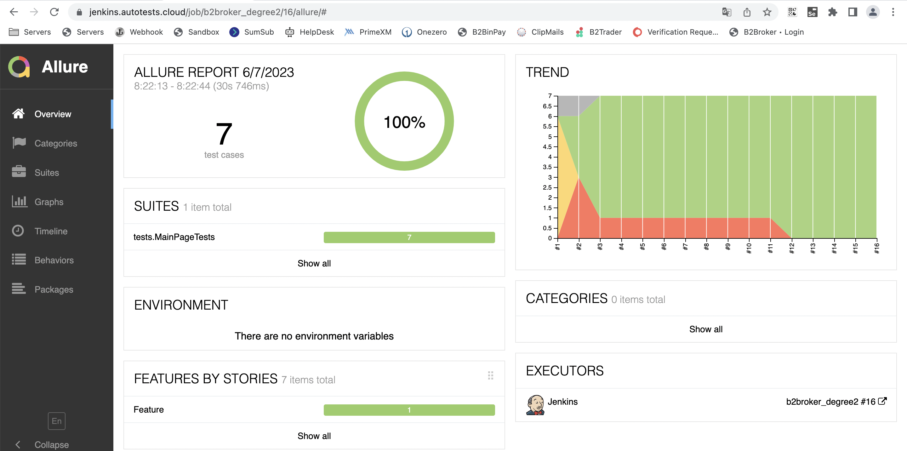
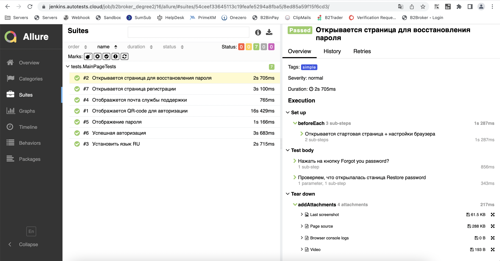
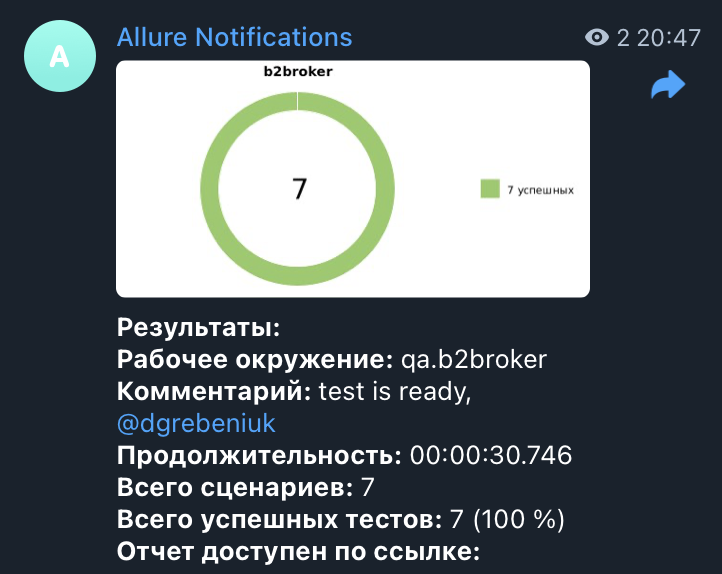

# Проект автоматизации тестирования для <a target="_blank" href="https://my.b2broker.com/">B2broker</a> 

## :open_book: Содержание:
- [Технологии и инструменты](#gear-в-проекте-используются-следующие-технологии-и-инструменты)
- [Что проверяем](#heavy_check_mark-что-проверяем)
- [Запуск тестов из Jenkins](#-запуск-тестов-из-jenkins)
- [Запуск тестов из терминала](#computer-запуск-тестов-из-терминала)
- [Отчеты](#bar_chart-отчеты-о-прохождении-тестов-доступны-в-allure)
- - [Allure](#-allure)
- - [Telegram](#-telegram)


## :gear: В проекте используются следующие технологии и инструменты:

<p align="center">


</p>

## :heavy_check_mark: Что проверяем

> - Проверка открывания страницы регистрации ;
> - Проверка открывания страницы восстановления пароля ;
> - Проверка переключения между языками ;
> - Проверка авторизации ;
> - Проверка наличия QR-code;
> - Проверка наличия информации о саппорте;
> - Проверка наличия кнопки отображения пароля.

##  Запуск тестов из [Jenkins](https://jenkins.autotests.cloud/job/b2broker_degree2/15/)

Для запуска тестов из Jenkins:
1. Необходимо нажать кнопку "Собрать с параметрами".
2. Выбрать параметры.
3. Нажать кнопку "Собрать".

### :earth_asia: Удаленный запуск тестов

```bash
clean
test
-DbrowserSize="${BROWSER_SIZE}"
-Dbrowser="${BROWSER}"
-DbrowserVersion="${BROWSER_VERSION}"
-DbaseUrl="${BASE_URL}"
-DremoteUrl="${REMOTE_URL}"
```

### :heavy_plus_sign: Параметры сборки

> - BROWSER (браузер)
> - VERSION (версия браузера)
> - RESOLUTION (размер окна браузера)
> - BASEURL (адрес сайта)

## :computer: Запуск тестов из терминала

Для локального запуска необходимо выполнить команду:
```
gradle clean
web_test
```

## :bar_chart: Отчеты о прохождении тестов доступны в Allure

###  Allure

#### Главная страница



#### Тесты



###  Telegram

Настроена отправка оточета ботом в Telegram




